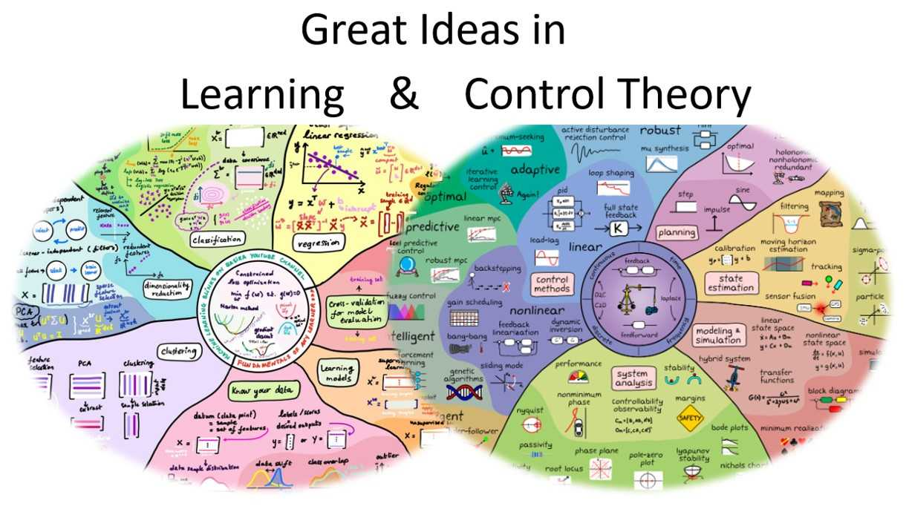

# Great Ideas in Learning and Control

{: width="500"}

Many of the great ideas that shaped today’s fields of control theory and machine learning were developed between in the 21th century. These ideas established the theoretical and conceptual foundations for how systems can learn, adapt, and make decisions. In this course, we will explore these ideas and their influence on modern learning and control.

**Course start:** Mid of January 2026.

**Registration:** Fill 

### Tentative list of lectures

| Lecture | Date | Room |  
|------|------|------|--------|
|Principles of information theory | TBD | TBD |
|Principles of dynamical system| TBD | TBD |
|Principles of extermal solutions| TBD | TBD |
|Principles of feedback| TBD | TBD |
|Principles of statistical learning| TBD | TBD |
|Principles of dynamic programming| TBD | TBD |

### Examination
* Write a brief reflection for each lecture.
* A collaborative project.

### Questions and Registration
If you have questions you can e-mail [Dave Zachariah](https://www.uu.se/en/contact-and-organisation/staff?query=N13-1398) or [Per Mattsson](https://www.uu.se/en/contact-and-organisation/staff?query=N10-1806). 

PhD students that finish the course can get 5 credits, but others that are interested can also follow along the course. If you want to register for the course (or just get information when the course starts) [fill in this form](https://doit.medfarm.uu.se/bin/kurt3/kurt/8895185).
